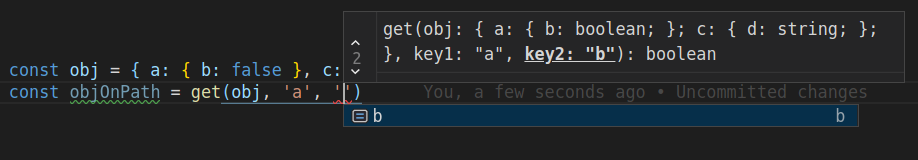
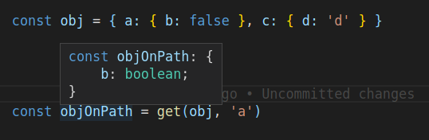
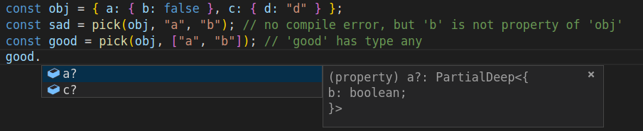

# tsfunct
Tsfuncts is a **T**ype**S**cript **funct**ional library made directly for TS with its static
typesystem in mind. 

### Motivation
There are many libraries which provide helper functions for JS/TS. Most popular are
[lodash](https://github.com/lodash/lodash) and [ramda](https://github.com/ramda/ramda) *(I encourage you to try them out)*.

#### Strongly typed functions
Most of the times, the libraries are good enough. Typings for these libraries is pretty decent, too.
However, not always...

There are certain helpers which can be typed better. Also, **lodash** (which I like the
most) doesn't have all functions immutable (e.g. `set`) and you have to memoize these or check
everytime...

#### Context
One thing that both **lodash** and **ramda** are not supporting is chaining. This makes sense,
because these functions are returning plain objects. One option is to add these functions to the
**prototype** of primitive types, but you would not get autocompletion this way. 

My solution is to wrap the `value` into specific **context**, which knows what helpers can be
executed on the `value`. Executing a function in a context will form a **new context with new
value** *(Although, type of the context may be different)*. 

Context allows you to autocomplete function names which can be called in that context. And as the
result is again a context, you get chaining out of the box. 

Disadvantage is that you are creating a new context with every context function call.

**NOTE: Context is right now an idea and it's not implemented yet.**

### Example functions

##### get(object, ...path)
Lodash typings for this helper are pretty weak. First of all, you don't get compile error for
incorrect usage and if you use it correctly the result will be typed as `any`. 

The path and also the result object is typed when using `get` from this libary.



**NOTE: The signature of get method has changed to array and now supports also default value.**
TODO: update screenshots 

The result of `get` call is also stongly typed. This helper only allows for getting nested values in
5 levels maximum. If you need more, you are probably doing something wrong ;).

#### pick(obj, properties[])
Lodash typings doesn't prevent you typing non-existent properties and returns weak typed object if
you do so *(It produces correct typings if you specify only correct properties, but you don't get
autocompletion)*. 


With helper from this library you get autocompletion on object properties and the result is always
strongly typed.

#### and many more...
You can see all helpers in the documentation and source code.
TODO: generate documentation and link it here.

### Immutability
All functions in this library are **effectively immutable**. That means that if you use the helpers
according to their idiomatic usage, library is immutable. However, you are able to modify the
original entity, for example, by using `map` helper this way:

```javascript
const original = [{ a: 0 }, { a: 1 }, { a: 2 }]
const mapped = map(original, (val: any) => (val.a = 3))
// mapped array will be [3, 3, 3]
// original will be [{ a: 3 }, { a: 3 }, { a: 3 }]
```
