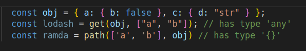
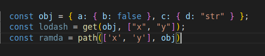
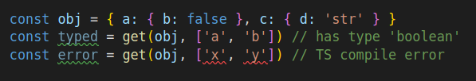
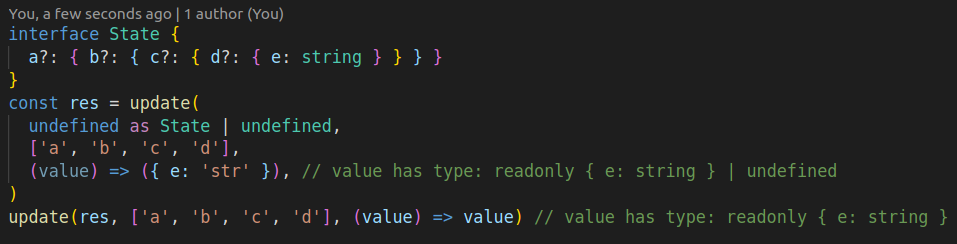

# Tsfunct [](https://circleci.com/gh/Siegrift/tsfunct)

Tsfunct is a **T**ype**S**cript **funct**ional library made directly with and for TS with its static
typesystem in mind.

## Installation

To install this package run either:

`yarn add @siegrift/tsfunct`

or if you use npm

`npm i @siegrift/tsfunct --save`

_**Important:** Some functions (set and friends) work reliably only with TS ^3.7, because of [this
issue](https://github.com/microsoft/TypeScript/issues/33468). Also, this library will be using
latest TS features when needed. Keep this in mind if you are trying to use it in your project._

## Motivation

There are two big libraries which provide helper functions for JS/TS. These are
[lodash](https://github.com/lodash/lodash) and [ramda](https://github.com/ramda/ramda). Both of
these libraries are made for JS and the TS typings for many functions are poor. Also, these
functions aim to be as general as possible, which makes it harder or even impossible to type
properly.

There are certain helpers _(mainly for immutable object manipulation)_ which can be typed better.
Let's take a look at `get(obj, path)` helper in both lodash _(4.14.132)_ and ramda _(0.26.9)_,
when using it on a strongly typed TS object.

<br/> _(Lodash gets it at least correct, but cannot
determine the result type. Ramda allows you to pass a type that is being returned, but you can omit
it and produce **incorrect** result type)_

<br/> _(There are no TS warnings about accessing
value on nonexistent path)_

Lets look what you can get by using `get(obj, path)` with TSfunct.

<br/> There are many advantages of this
helper:

- The result has correct type
- The path can be autocompleted and must be able to exist in the object
- Handles arrays, optional and nullable values (even in intermediate objects)

<br/> _When you call update for the first time, `value` in
update function can be `undefined` (if any intermediate value doesn't exist). However, when calling
it for a second time, it is guaranteed that the values on the path exist._

Refer to documentation, source code and tests for more examples.

## Immutability

All functions in this library are **effectively immutable**. That means that if you use the helpers
according to their idiomatic usage, library is immutable. However, there are no deep copies created
for the source values and you are able to modify the original entity if you try really hard.

```javascript
const original = [{ a: 0 }, { a: 1 }, { a: 2 }]
const mapped = map(original, (val) => (val.a = 3))
// 'mapped'  will equal to [3, 3, 3]
// 'original' will equal to [{ a: 3 }, { a: 3 }, { a: 3 }]
```

## API and documentation

Documentation is automatically generated from source code and can be found at github pages
[here](https://siegrift.github.io/tsfunct/).

You can also play with the library on [CodeSandbox](https://codesandbox.io/s/tsfunct-zysfi).

_You can read the list and sources of all helpers in the src/lib folder
[here](https://github.com/Siegrift/tsfunct/tree/master/src/lib)._

## Chaining

TLDR: It is a bad idea. If you want to learn more, read
[this article](https://medium.com/making-internets/why-using-chain-is-a-mistake-9bc1f80d51ba)

## Functional programming style

All of the functions in this library are written **imperatively (FOR NOW!!!)**
(e.g. `const get = (object, path) => implementation` compared
to traditional functional `const get = (path) => (object) => implementation`) for better typing and
autocompletion support.

If you want more FP style have a look at [monocle](https://github.com/gcanti/monocle-ts) or [fp
ts](https://github.com/gcanti/fp-ts) or [lodash
fp](https://github.com/lodash/lodash/wiki/FP-Guide)

## Codebase overview

Each helper is written in its own module without depending on other helper. This allows you to copy
the source of single helper you want without installing the whole library.

## Limitations

Most of the helpers are typed manually and have some restrictions on its arguments. For example,
path array can be **up to X elements** only in some helpers...

Bear in mind that TS is unsound! Types might easily lie to you if you are not careful. For example,

```javascript
const arr: number[] = [1, 2, 3]
const num: number = get(arr, [999]) // this line won't trigger TS error!
console.log(num) // undefined!
```

Other limitation is for example TS path autocompletion for immutability helpers, which I reported
and is tracked in [this issue](https://github.com/microsoft/TypeScript/issues/31630) and will be
fixed in the future.

## Issues

Each helper is heavily tested and I try to make the library as stable as possible. In case there is
a bug or unwanted behavior, please create an issue.

## Contribution

If you would like to fix an issue or create another helper, feel free to create a PR for it. To
contribute just follow these steps:

1. fork the repository
2. make sure you have yarn installed and run: `yarn`
3. create a new branch with you feature
4. commit & push
5. create PR to the original repo
